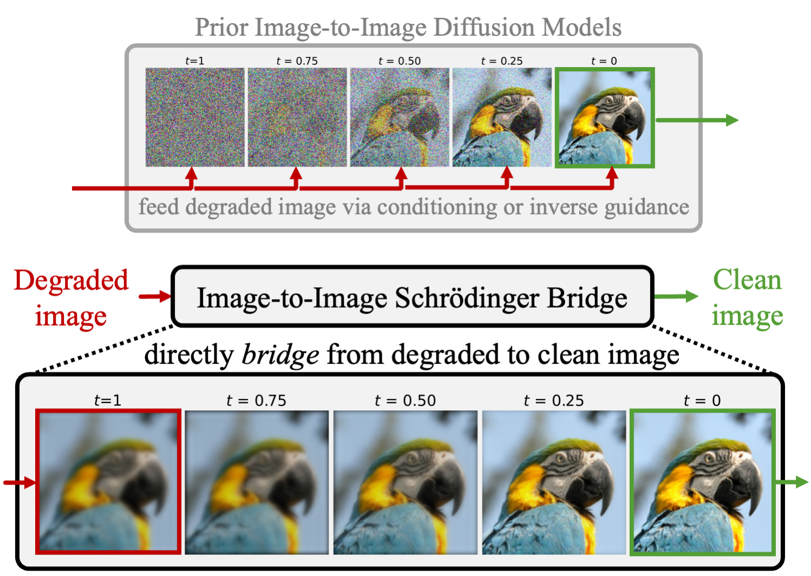
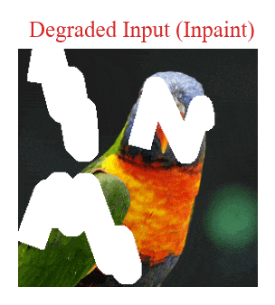
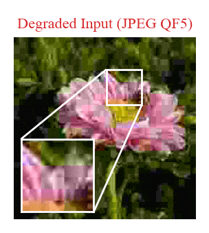
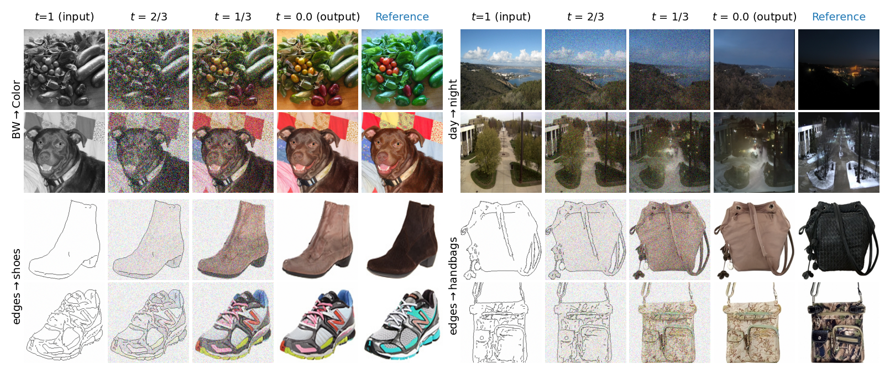

<h1 align="center">  I<sup>2</sup>SB: Image-to-Image Schrödinger Bridge  </h1>
<div align="center">
  <a href="https://ghliu.github.io/" target="_blank">Guan-Horng&nbsp;Liu</a><sup>1</sup> &ensp; <b>&middot;</b> &ensp;
  <a href="http://latentspace.cc/arash_vahdat/" target="_blank">Arash&nbsp;Vahdat</a><sup>2</sup> &ensp; <b>&middot;</b> &ensp;
  <a href="https://ai.stanford.edu/~dahuang/" target="_blank">De-An&nbsp;Huang</a><sup>2</sup> &ensp; <b>&middot;</b> &ensp;
  <a href="https://sites.gatech.edu/acds/people/" target="_blank">Evangelos&nbsp;A.&nbsp;Theodorou</a><sup>1</sup>
  <br>
  <a href="https://weilinie.github.io/" target="_blank">Weili&nbsp;Nie</a><sup>2,</sup>† &ensp; <b>&middot;</b> &ensp;
  <a href="http://tensorlab.cms.caltech.edu/users/anima/" target="_blank">Anima&nbsp;Anandkumar</a><sup>2,3,</sup>† <br>
  <sup>1</sup>Georgia Tech &emsp; <sup>2</sup>NVIDIA Corporation &emsp; <sup>3</sup>Caltech &emsp; †equal advising <br>
</div>
<h3 align="center">[<a href="https://i2sb.github.io/">project page</a>] [<a href="https://arxiv.org/abs/2302.05872">arXiv</a>]</h3>

Official PyTorch implementation of **I<sup>2</sup>SB**, a new class of conditional diffusion models that directly construct diffusion bridges between two given distributions. **I<sup>2</sup>SB** yields interpretable generation, enjoys better sampling efficiency, and sets new records on many image restoration tasks.

<div align="center">
    
</div>

## General image-to-Image translation

In additinoal to image restoration tasks, **I<sup>2</sup>SB** can also be applied to general image-to-image translation such as [pix2pix](https://github.com/phillipi/pix2pix). For more general tasks, we recommand adding the flag `--cond-x1` to the [training options](https://github.com/NVlabs/I2SB#training) to overcome the large information loss in the new priors.
Visualization of the generation processes of **I<sup>2</sup>SB** are shown below.

<div align="center">
    
</div>

## Installation

This code is developed with Python3, and we recommend PyTorch >=1.11. Install the dependencies with [Anaconda](https://www.anaconda.com/products/individual) and activate the environment `i2sb` with
```bash
conda env create --file requirements.yaml python=3
conda activate i2sb
```

## Download pre-trained checkpoints

All checkpoints are trained with 2 nodes, each with 8 32GB V100 GPUs. Pre-trained checkpoints and can be downloaded from [here](https://drive.google.com/drive/folders/1sgHF2FjgsAiV7doBeeOiBD8NyQhKutsG) or via
```bash
bash scripts/download_checkpoint.sh $NAME
```
where `NAME` can be one of the following image restoration tasks
- `jpeg-5`: JPEG restoration with quality factor 5
- `jpeg-10`: JPEG restoration with quality factor 10
- `sr4x-pool`: 4x Super-resolution with pooling filter
- `sr4x-bicubic`: 4x Super-resolution with bicubic filter
- `blur-uni`: Deblurring with uniform kernel
- `blur-gauss`: Deblurring with Gaussian kernel
- `inpaint-center`: Inpainting with 128x128 center mask
- `inpaint-freeform1020`: Inpainting with 10-20% freeform mask
- `inpaint-freeform2030`: Inpainting with 20-30% freeform mask

Checkpoints will be stored in `results/$NAME`. After downloaded, you can run the [sampling](https://github.com/NVlabs/I2SB#sampling) and [evaluation](https://github.com/NVlabs/I2SB#evaluation) with the provided command lines.


## Sampling

To sample from some checkpoint `$NAME` saved under `results/$NAME`, run

```bash
python sample.py --ckpt $NAME --n-gpu-per-node $N_GPU \
    --dataset-dir $DATA_DIR --batch-size $BATCH --use-fp16 \
    [--nfe $NFE] [--clip-denoise]
```
where `N_GPU` is the number of GPUs on the node and `DATA_DIR` is the path to the LMDB dataset. By default, we use `--use-fp16` for faster sampling. The number of function evaluations (`NFE`) determines sampling steps and, if unspecified, is set as in training. In practice, **I<sup>2</sup>SB** is insensitive to `--clip-denoise`, which clamps the predicted clean images to [-1,1] at each sampling step.

The reconstruction images will be saved under `results/$NAME/samples_nfe$NFE/`. By default, we use the full validation set for 4x super-resolution tasks and the [10k subset suggested by Palette](https://bit.ly/eval-pix2pix) for the rest of the restoration tasks.

(Optional) To parallelize the sampling across multiple nodes, add `--partition 0_4` so that the dataset is  partitioned into 4 subsets (indices 0,1,2,3) and only run the first partition, _i.e._ index 0. Similarly, `--partition 1_4` run the second partition, and so on.

## Evaluation

To evaluate the reconstruction images saved under `results/$NAME/$SAMPLE_DIR/`, run
```bash
python compute_metrices.py --ckpt $NAME --dataset-dir $DATA_DIR --sample-dir $SAMPLE_DIR
```
to compute the accuracy on ResNet-50 and FID. The FID computation is based on [`clean-fid`](https://github.com/GaParmar/clean-fid) package with `mode="legacy_pytorch"`.

Regarding the FID reference statistics, we follow Palette and ΠGDM and use the full training set for 4x super-resolution tasks and the full validation set for the rest of the restoration tasks. The statistics of training set will be automatically downloaded from [ADM](https://github.com/openai/guided-diffusion/tree/main/evaluations), and the statistics of validation set will be computed and saved to `data/fid_imagenet_256_val.npz` at first call.


## Data and results

We train and evaluate **I<sup>2</sup>SB** on ImageNet 256x256 with the LMDB format; hence, you may need to [convert the image folder to LMDB](https://github.com/Lyken17/Efficient-PyTorch/tree/master/tools). Use the flag `--dataset-dir $DATA_DIR` to specify the dataset directory. **Images should be normalized to [-1,1].** External data (_e.g._, ADM checkpoints, FID ref statistics) will be automatically downloaded and stored in `data/` at first call. All training and sampling results will be stored in `results`. The overall file structures are:
```bash
$DATA_DIR/                           # dataset directory
├── train_faster_imagefolder.lmdb    # train images in LMDB format
├── train_faster_imagefolder.lmdb.pt # train ImageFolder with (path,label) list
├── val_faster_imagefolder.lmdb      # val images in LMDB format
└── val_faster_imagefolder.lmdb.pt   # val ImageFolder with (path,label) list

data/                        # auto-downloaded files:
└── ...                      # ADM checkpoints, FID ref stats, freeform masks, etc.

results/
├── $NAME/                   # experiment ID set in train.py --name $NAME
│   ├── latest.pt            # latest checkpoint: network, ema, optimizer
│   └── options.pkl          # full training options
│   └── samples_nfe$NFE/     # images reconstructed from sample.py --nfe $NFE
│       └── recon.pt
├── ...
```


## Training

To train an **I<sup>2</sup>SB** on a single node, run
```bash
python train.py --name $NAME --n-gpu-per-node $N_GPU \
    --corrupt $CORRUPT --dataset-dir $DATA_DIR \
    --batch-size $BATCH --microbatch $MICRO_BATCH [--ot-ode] \
    --beta-max $BMAX --log-dir $LOG_DIR [--log-writer $LOGGER]
```
where `NAME` is the experiment ID (default: `CORRUPT`), `N_GPU` is the number of GPUs on each node, `DATA_DIR` is the path to the LMDB dataset, `BMAX` determines the noise scheduling. The default training on 32GB V100 GPU uses `BATCH=256` and `MICRO_BATCH=2`. If your GPUs have less than 32GB, consider lowering `MICRO_BATCH` or using samller network. `CORRUPT` can be one of the following restoration tasks:
- JPEG restoration: quality factor 5 or 10 (`jpeg-5`,`jpeg-10`)
- 4x Super-resolution: pool or bicubic filter (`sr4x-pool`,`sr4x-bicubic`)
- deblurring: uniform or Gaussian kernel  (`blur-uni`, `blur-gauss`)
- 128x128 center-masked inpainting (`inpaint-center`)
- freeform inpainting: masked ratio 10-20% or 20-30% (`inpaint-freeform1020`,`inpaint-freeform2030`)

Add `--ot-ode` for optionally training an OT-ODE model, _i.e.,_ the limit when the diffusion vanishes. By defualt, the model is discretized into 1000 steps; you can change it by adding `--interval $INTERVAL`.
Note that we initialize the network with [ADM](https://github.com/openai/guided-diffusion) ([256x256_diffusion_uncond.pt](https://openaipublic.blob.core.windows.net/diffusion/jul-2021/256x256_diffusion_uncond.pt)), which will be automatically downloaded to `data/` at first call.

Images and losses can be logged with either tensorboard (`LOGGER="tensorboard"`) or W&B (`LOGGER="wandb"`) in the directory `LOG_DIR`. To [autonamtically login W&B](https://docs.wandb.ai/quickstart#set-up-wb), specify additionally the flags `--wandb-api-key $WANDB_API_KEY --wandb-user $WANDB_USER` where `WANDB_API_KEY` is the unique API key (about 40 characters) of your account and `WANDB_USER` is your user name.

To resume previous training from the checkpoint, add the flag `--ckpt $CKPT`.

See [`scripts/train.sh`](https://github.com/NVlabs/I2SB/blob/master/scripts/train.sh) for the hyper-parameters of each restoration task.


## Multi-Node Training

For multi-node training, we recommand the MPI backend.
```bash
mpirun --allow-run-as-root -np $ARRAY_SIZE -npernode 1 bash -c \
    'python train.py $TRAIN \
    --num-proc-node $ARRAY_SIZE \
    --node-rank $NODE_RANK \
    --master-address $IP_ADDR '
```
where `TRAIN` wraps all the the [original (single-node) training options](https://github.com/NVlabs/I2SB#training), `ARRAY_SIZE` is the number of nodes, `NODE_RANK` is the index of each node among all the nodes that are running the job, and `IP_ADDR` is the IP address of the machine that will host the process with rank 0 during training; see [here](https://pytorch.org/tutorials/intermediate/dist_tuto.html#initialization-methods).


## Citation

```
@article{liu2023i2sb,
  title={I{$^2$}SB: Image-to-Image Schr{\"o}dinger Bridge},
  author={Liu, Guan-Horng and Vahdat, Arash and Huang, De-An and Theodorou, Evangelos A and Nie, Weili and Anandkumar, Anima},
  journal={arXiv preprint arXiv:2302.05872},
  year={2023},
}
```

## License
Copyright © 2023, NVIDIA Corporation. All rights reserved.

This work is made available under the Nvidia Source Code License-NC.

The model checkpoints are shared under [CC-BY-NC-SA-4.0](https://creativecommons.org/licenses/by-nc-sa/4.0/legalcode). If you remix, transform, or build upon the material, you must distribute your contributions under the same license as the original.

For business inquiries, please visit our website and submit the form: [NVIDIA Research Licensing](https://www.nvidia.com/en-us/research/inquiries/).